# FlowDictate Architecture

Status: **Proposed**  
Milestone: 0  
Primary quality attributes: privacy, security, bounded resource use, offline reliability, low latency

## Requirements summary

### Functional v1 path

Hold hotkey → capture audio → detect speech → produce stable local partial text → deterministically refine → validate → insert plain text at the focused cursor.

### Non-functional constraints

- Offline operation is normal operation, not a degraded mode.
- No telemetry, analytics, remote logging, cloud inference, remote personalization, or hidden fallback.
- CPU-only operation on a dual-core, 4 GB machine.
- Sensitive inputs are minimized, bounded, short-lived, and absent from release logs.
- Security failures fail closed where confidentiality/integrity is at risk and fall back locally where availability is at risk.
- Cross-platform interfaces are preserved, but platform support is earned through testing rather than claimed from abstraction alone.

## Proposed repository structure

```text
FlowDictate/
├── README.md
├── Cargo.toml                  # future workspace manifest; not created in M0
├── Cargo.lock                  # committed once dependencies are approved
├── deny.toml                   # license/advisory/source policy
├── crates/
│   ├── flowdictate-core/       # state machine and typed pipeline contracts
│   ├── flowdictate-audio/      # capture callback, bounded queues, PCM/resampling
│   ├── flowdictate-vad/        # streaming VAD and utterance boundaries
│   ├── flowdictate-asr/        # whisper adapter and consensus commit
│   ├── flowdictate-refine/     # deterministic cleanup and optional local editor
│   ├── flowdictate-models/     # manifest parser, path/hash/size gates
│   ├── flowdictate-storage/    # SQLCipher, history modes, migrations
│   ├── flowdictate-platform/   # hotkey, focus, insertion, secure-store ports
│   └── flowdictate-privacy/    # redaction-safe events and privacy invariants
├── app/
│   ├── src-tauri/              # thin process composition and capability policy
│   └── ui/                     # bundled vanilla HTML/CSS/JS overlay only
├── fixtures/
│   ├── audio/                  # synthetic, non-personal fixtures
│   └── privacy-markers/        # unique leak-detection markers
├── fuzz/                       # isolated, offline fuzz targets
├── benches/                    # benchmark harness and manifests
├── docs/
│   └── adr/
└── scripts/                    # build/audit tooling; excluded from runtime
```

Each future crate must expose narrow typed interfaces. Platform adapters may depend inward on core contracts; core contracts must not depend on Tauri, OS APIs, SQLCipher, or model runtimes.

## Runtime architecture

```mermaid
flowchart LR
  User[User] -->|hold/release hotkey| Hotkey[Platform hotkey adapter]
  Mic[OS microphone] -->|native PCM| Callback[Real-time capture callback]
  Callback -->|bounded frames| Ring[Preallocated SPSC ring]
  Ring --> Worker[Audio worker]
  Worker -->|mono 16 kHz PCM| VAD[VAD and segmenter]
  VAD -->|event-aligned canonical frames| Utterance[Volatile utterance pipeline]
  Utterance -->|bounded final window| Supervisor[ASR IPC supervisor]
  Supervisor -->|bounded anonymous pipes| ASR[Isolated local ASR worker]
  ASR -->|validated bounded transcript| Supervisor
  Supervisor --> Consensus[Consensus commit]
  Consensus --> Overlay[Local overlay state]
  Consensus --> Rules[Deterministic refinement]
  Rules --> Router{Semantic rewrite needed?}
  Router -->|no| Guard[Output validator]
  Router -->|yes and local model approved| LocalEditor[Optional local editor]
  LocalEditor --> Guard
  Guard --> Insert[Platform text insertion]
  Insert --> Focused[Focused application]
  Models[(Verified local models)] --> Supervisor
  Models --> LocalEditor
  KeyStore[OS credential store] --> Storage[(SQLCipher database)]
  Rules -. explicit dictionary lookup .-> Storage

  Network[[Network]] -. no runtime path .- Callback
  Network -. no runtime path .- ASR
  Network -. no runtime path .- Storage
```



## Execution domains

| Domain | Responsibilities | Forbidden work |
|---|---|---|
| Real-time audio callback | Copy/normalize native samples into preallocated slots; increment non-sensitive counters | Allocation, disk, database, network, inference, formatting, blocking locks, sensitive logs |
| Audio worker | Channel conversion, resampling, framing, VAD, bounded segmentation | Unbounded queues/windows; persistent audio |
| Live session owner | Gate paused capture behind explicit start; bounded ring drain; discontinuity, stop, and cancel cleanup | Implicit/background listening; retained raw audio; unbounded catch-up |
| Utterance pipeline | Bounded confirmation pre-roll, finalization, cancellation, direct ASR dispatch | Persistent audio; unbounded backlog; crossing discontinuities |
| ASR supervisor | Verify model handle/bytes, bound IPC, validate output, enforce deadline and restart | Native inference; reopening model paths; cloud fallback |
| ASR child process | Independently verify transferred model bytes; bounded CPU inference | Model-path discovery, network, persistence, UI, unbounded IPC |
| Refinement worker | Deterministic cleanup; optional local editor; fallback | Treating transcript/context as policy; inventing content |
| UI thread | Render state, real level, partial text; expose privacy state | Remote assets, broad context access, transcript logging |
| Persistence worker | Encrypted transactions and retention enforcement | Opening persistent history without key-store/SQLCipher verification |
| Platform adapter | Hotkey, focused control, plain-text insertion | Shell execution; interpreting transcript as commands |

## Trust-boundary rules

1. Microphone frames become trusted only as bounded numeric samples; their content remains sensitive.
2. Model files, imported profiles, audio files, context, and transcripts are always untrusted input.
3. UI commands are schema-validated and capability-allowlisted at the Tauri boundary.
4. The optional local editor receives a fixed policy separately from delimited untrusted content.
5. Text insertion accepts a text value, not a command, script, key sequence, or shell string.
6. Storage opens only after encryption and key custody are verified; otherwise the app runs statelessly.

## State machine

```text
Idle
  -> Listening (authorized hotkey + bounded session created)
  -> Processing (release, silence, stop, or forced segment boundary)
  -> Success (validated text inserted)
  -> Idle

Any active state
  -> Warning (recoverable local failure; local fallback attempted)
  -> PrivacyAlert (integrity/key/context boundary failure; operation stopped)
  -> Idle
```

Every active state has maximum duration, cancellation, and teardown that clears owned audio/transcript buffers where practical.

## Failure modes

| Failure | Required behavior |
|---|---|
| Ring full | Drop according to a documented policy, increment a non-sensitive metric, warn; never block callback |
| Hotkey release lost | Silence/maximum-duration boundary finalizes or cancels the segment |
| Resampler/VAD failure | Stop capture safely; do not grow a raw-audio backlog |
| ASR OOM/timeout/decoder failure | Discard model state, preserve bounded audio only for the current fallback decision, never use cloud |
| Local editor fails | Use deterministic result, then sanitized raw transcript if needed |
| Model hash/size/path mismatch | Refuse to load and show a security alert |
| Credential store unavailable | Disable persistent history; do not create plaintext storage |
| SQLCipher unavailable or cipher check fails | Refuse persistent database creation/open |
| Text insertion fails | Keep final text in a short-lived in-app recovery panel; clipboard copy requires explicit action |
| UI/WebView attempts navigation | Deny, raise security event, and retain no remote response |

## Major decisions

- Local modular monolith, not services: [ADR-0001](adr/0001-local-modular-monolith.md)
- Network-free runtime boundary: [ADR-0002](adr/0002-network-free-runtime.md)
- Volatile bounded audio: [ADR-0003](adr/0003-volatile-bounded-audio.md)
- Fail-closed model gate: [ADR-0004](adr/0004-fail-closed-model-integrity.md)
- Encrypted persistence with OS key custody: [ADR-0005](adr/0005-encrypted-persistence.md)
- Provisional Tauri/vanilla overlay: [ADR-0006](adr/0006-provisional-tauri-overlay.md)

## Explicitly out of scope for v1

- Voice-triggered commands or arbitrary action execution
- Screen capture or ambient OCR
- Automatic downloads or update checks
- Cloud services of any kind
- Broad media import, FFmpeg, MP3, AAC, or video parsing
- Hidden adaptive profiles
- Production claims for unbenchmarked languages or hardware
