# Audio Pipeline

Status: **Milestone 1 capture/DSP/VAD and bounded final-utterance ASR seam implemented**

## Implemented Milestone 1 slice

- CPAL input enumeration plus a default-device stream constructed in the paused state.
- Exact format validation: 8–192 kHz and mono/stereo only; the adapter prefers 48, 44.1, 16, or 8 kHz and falls back to any advertised rate inside that bounded range, using only `f32`, `i16`, or `u16` PCM.
- Fixed two-second SPSC ring with whole-batch drop and a monotonic discontinuity epoch on overflow.
- Callback conversion and atomic health counters with no application allocations after warm-up in the tested public seam.
- Preallocated worker downmixing, Rubato resampling to mono 16 kHz, real peak/RMS calculation, exact 256-sample Earshot frames, and bounded segmentation.
- Event-aligned canonical frame output into caller-owned preallocated storage.
- Bounded confirmation pre-roll and one volatile utterance dispatched synchronously to the process-isolated ASR worker.
- One-shot cancellation that discards pending audio or terminates and replaces in-flight native inference.
- Discontinuity resets resampler/VAD state and finalizes any active utterance boundary.
- Live codec policy accepts volatile `f32` PCM only; WAV is fixture-only and FLAC/Opus/recording remain disabled.
- A development-only consent-first probe drains and zeroes its caller-owned buffer, caps live capture at 30 seconds, and reports only fixed format fields and numeric counters.

The crate spawns no hidden application thread and writes no audio file. The owner must schedule worker calls and explicitly invoke capture `resume`; stream construction alone does not approve listening.

## Canonical flow

```mermaid
flowchart LR
  Device[Native input\ninterleaved PCM] --> Callback[Real-time callback\ncopy/normalize only]
  Callback --> Ring[2 s bounded SPSC ring]
  Ring --> Convert[Deinterleave/downmix]
  Convert --> Resample[Resample outside callback]
  Resample --> Canonical[Mono 16 kHz f32 PCM]
  Canonical --> Frames[16 ms VAD frames]
  Frames --> VAD[VAD/state machine]
  VAD --> Utterance[Bounded volatile utterance]
  Utterance --> Supervisor[ASR process supervisor]
  Supervisor --> Decode[Isolated local decode]
  Decode --> Final[Validated final raw transcript]
```



Compressed codecs are not present in this live path.

## Real-time callback contract

The callback may:

- read the provided device buffer and a pre-created format descriptor;
- perform simple numeric conversion/copy into an already reserved ring slot;
- update lock-free, non-sensitive counters;
- return immediately.

The callback must not allocate, grow a collection, format text, log samples, lock a mutex, wait, touch disk/database/network/UI, resample, run VAD/ASR, or call platform APIs that may block.

All resources are created before capture starts. Milestone 1 allocator instrumentation is present for the public callback-write seam and the warmed worker chunk; both regression tests currently report zero allocations during the measured call.

## Formats and limits

| Boundary | Initial accepted representation | Limit/policy |
|---|---|---|
| Device input | CPAL-supported integer or float PCM | Prefer 16/44.1/48 kHz, mono/stereo; reject unsupported/absurd configurations rather than generalize |
| Ring slot | Fixed-capacity native-rate frames with timestamp/sequence | Capacity equivalent to 2 seconds at negotiated format; no growth |
| Worker canonical PCM | Mono 16 kHz `f32` in `[-1, 1]` | Non-finite samples become zero and raise a safe counter; saturating conversion |
| VAD frame | 256 samples / 16 ms at 16 kHz for initial Earshot candidate | Exact length; discontinuity resets state |
| ASR request audio | Mono 16 kHz bounded window | Maximum 480,000 samples / 30 seconds |
| Active utterance | One preallocated volatile buffer | Confirmation pre-roll + active frames must fit the ASR request limit |
| Finalized transcripts | Caller-owned preallocated output vector | Spare capacity validated before processing; no internal backlog |

All numbers are configurable only within compiled safe ranges. Configuration cannot disable hard caps.

## Downmix and normalization

- Mono input passes through after type conversion.
- Stereo downmix uses a documented average with headroom/saturation; channel layouts beyond the supported set are rejected for v1.
- NaN/infinity values never propagate into DSP/model code.
- No automatic gain control is added initially; driver-provided processing is reported where detectable but not controlled by FlowDictate.
- Microphone level for the overlay is derived from actual bounded frame RMS/peak metadata, never fabricated and never persisted.

## Resampling

Resampling runs on the audio worker, not the callback. A resampler instance and its working buffers are created before listening. Input/output chunk ranges are validated, and worker scheduling must keep ring occupancy below the warning threshold.

Benchmark each supported source rate for:

- real-time factor and per-frame p50/p95;
- allocations after warm-up;
- peak working memory;
- aliasing/speech-quality impact using deterministic fixtures;
- behavior on discontinuity and device-rate change.

## VAD state machine

```text
Silence
  -- threshold crossed for start-hangover --> Speech
Speech
  -- short quiet period --> MaybePause
MaybePause
  -- speech resumes --> Speech
MaybePause
  -- final-silence threshold --> Finalize
Any state
  -- hotkey release / explicit stop --> Finalize
Any state
  -- discontinuity / hard limit / worker failure --> FinalizeOrCancel + reset
```

The detector score is an input to a bounded state machine, not an authority to retain audio indefinitely. Thresholds/hangovers are benchmarked across noise/language fixtures. An inexpensive energy/noise sanity gate remains available if the neural VAD fails to initialize, but it must not weaken hard duration/memory limits.

## Current final decode and rolling consensus components

The legacy `LiveSession` path performs one bounded decode when silence, maximum
duration, hotkey release, or explicit stop finalizes an utterance. The new
`StreamingLiveSession` path instead routes exact active canonical frames through
bounded rolling inference and consensus. Both paths discard a discontinuous
utterance rather than decoding audio across an unknown gap.

The implemented consensus engine accepts bounded transcript observations with
validated relative timestamps and checked absolute window offsets. It:

1. normalizes only comparison-safe whitespace, without changing displayed meaning;
2. compares the latest hypotheses over repeated windows;
3. commits the longest prefix stable across a configurable number of observations and outside an unstable trailing time margin;
4. never rewrites a committed prefix within the same segment;
5. reports the timestamp before which PCM may be discarded while retaining a small overlap;
6. resets on discontinuity, language/model change, or session identity change.

At finalization, one bounded final decode may revise only the uncommitted suffix.
Committed text is emitted once and not retained by the consensus engine. The
new `RollingInference` owner preallocates a canonical PCM window, enforces a
minimum window and new-audio cadence, runs at most one decode per push, feeds
hypotheses to consensus, and overwrites committed PCM while preserving the
configured overlap. Cancellation, discontinuity, malformed input, ASR failure,
or invalid hypotheses erase its volatile PCM and pending text. If timestamp
behavior is unreliable for a model, the system reduces commit aggressiveness
rather than risking incorrect stable text. The streaming session exposes no
internal event queue: the current pending hypothesis is borrowed and immutable
commit deltas are appended only to caller-owned preallocated storage.

## Overflow and failure policy

- The producer never blocks. If a complete incoming slot cannot be written, drop that slot, increment an overflow counter, and mark a discontinuity.
- The worker closes/cancels the affected segment at the discontinuity and resets DSP/VAD/consensus state; it never joins speech across unknown missing audio.
- The UI shows a non-sensitive warning such as `Audio overload; some speech was not captured`.
- Repeated overflow transitions to a safe stopped state rather than a retry loop.
- Device removal, permission loss, invalid samples, and worker panic all stop capture and release owned buffers.

## Synthetic test fixture plan

- Programmatically generated silence, tones, chirps, clipped values, NaN/infinity (for float test boundary), multi-channel phase cases, and deterministic speech-like envelopes.
- Redistributable public speech fixtures are added only after license/provenance review and are never user recordings.
- Tests cover every supported input sample type/rate/channel combination, rate drift, irregular callback sizes, sequence gaps, overflow, stuck hotkey, long silence, continuous noise, and hours-equivalent virtual time.

## Unsupported claims

Unverified — requires human testing: actual microphone permission UX, device enumeration quality, driver behavior, callback scheduling under desktop load, acoustic VAD quality, and perceived partial-transcript stability on each target OS.

The probe has been compiled. The non-consent path refused before the microphone builder, and one explicitly consented run reached CPAL stream construction but failed closed because the host's advertised 192 kHz profile was rejected there; no audio report or payload was emitted.
