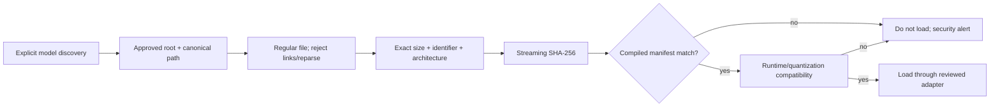

# Model Security and Local Refinement Architecture

Status: **Integrity gate, reviewed CPU adapter, and process isolation implemented**

## Model trust policy

Model weights and their metadata are untrusted executable-adjacent input. For v1, only release-curated model identities in the compiled manifest may load. A user choosing a file does not make its native parser safe.

## Compiled manifest

The release build embeds records equivalent to:

```json
{
  "schema_version": 1,
  "models": [
    {
      "id": "asr-whisper-tiny-multilingual-q5_1",
      "file_name": "ggml-tiny-q5_1.bin",
      "purpose": "asr",
      "architecture": "whisper",
      "quantization": "q5_1",
      "size_bytes": 32152673,
      "sha256": "818710568da3ca15689e31a743197b520007872ff9576237bda97bd1b469c3d7",
      "runtime": "whisper.cpp",
      "source_revision": "98aa99a0a9db05ae2342309f5096248665f7cba3",
      "languages": ["multilingual"],
      "license_id": "MIT"
    }
  ]
}
```

The current record contains measured exact values. The release manifest is compiled into the binary and must be covered by release signatures/hashes. A detached local file cannot replace it. The selected adapter is exact `whisper-rs` 0.16.0, whose `whisper-rs-sys` 0.15.0 package bundles `whisper.cpp` 1.8.3.

## Integrity gate



The production Whisper implementation keeps the verified file identity stable between hashing and loading. The parent rewinds and reads the same already-hashed, read-only shared handle into an exact-size bounded buffer. It transfers those bytes—not a path—over the bounded worker startup protocol. The child independently re-verifies the compiled identity, compatibility, size, and SHA-256 before `flowdictate-asr` calls `WhisperContext::new_from_buffer_with_params`. The production native path loader is never called. The experimental Windows Nemotron probe instead retains the exact verification handle with read-only sharing as an immutable path lease while the reviewed path-only runtime opens the canonical path; write and delete replacement are tested to fail until the lease drops. Non-Windows path leases are rejected.

Unknown hash, unknown architecture, unexpected size, unsupported quantization/runtime, non-regular file, path outside the approved root, metadata parse failure, or hash read failure all reject. There is no warning-and-continue mode.

## Supply-chain lifecycle

1. Maintainer obtains model from a documented upstream source outside the production app.
2. License/provenance, architecture, conversion tool, quantization, and runtime compatibility are reviewed.
3. Conversion occurs in a controlled build environment with pinned tools.
4. Exact output size and SHA-256 are recorded; a second environment reproduces or independently verifies where practical.
5. Manifest and release artifacts are reviewed, signed, and published with hashes/SBOM.
6. User manually installs the artifact; local gate verifies before load.
7. Revoked/vulnerable model identities are removed by a signed application release, never a silent remote list.

## ASR strategy

- Begin with the adopted quantized multilingual Whisper tiny model through exact `whisper-rs` 0.16.0 / `whisper.cpp` 1.8.3 CPU-only bindings.
- Select the smallest candidate meeting accuracy, latency, and memory gates on baseline hardware.
- Keep the active decode window bounded and reuse model state without retaining unnecessary audio/transcript copies.
- Models failing initialization, memory, decode, timeout, or token validation cannot crash the dictation state machine.

## Implemented ASR bounds

- Exactly mono 16 kHz normalized `f32` PCM; reject empty, non-finite, out-of-range, or over-480,000-sample windows.
- At most 30 seconds per synchronous call, 1–8 CPU threads, greedy `best_of=1`, temperature zero, no prior context, no prompt, no translation, and no internal VAD.
- Native progress, segment, and abort callbacks are not installed. Runtime/GGML logging hooks are installed with no logging backend, suppressing their default stdout/stderr output.
- At most 128 segments and 65,536 UTF-8 bytes; invalid UTF-8 and negative, reversed, or over-window timestamps fail closed.
- All public adapter failures are fixed payload-free variants.

The 30-second audio bound is supplemented by a parent-enforced wall-clock deadline. Because the reviewed wrapper callback was not accepted as a security boundary, native inference runs in a child process. Deadline expiry kills and reaps that process and starts a clean generation from retained verified bytes; a real-model release test proves the process ID changes after a forced 10 ms timeout. An inability to confirm termination fails as `RecoveryFailed` rather than waiting indefinitely.

## Refinement boundary

Deterministic cleanup is the default:

```text
bounded raw transcript
  -> Unicode/punctuation/spacing validation
  -> deterministic rule engine
  -> complexity/confidence decision
  -> optional local editor only when justified
  -> output validation
  -> deterministic result on any model failure/violation
  -> sanitized raw transcript if deterministic processing fails
```

The optional editor:

- is not selected until the no-model baseline is measured;
- starts in the 0.3B–1B quantized range;
- has no tools, network, filesystem, clipboard, UI, database, or action capability;
- receives immutable system policy separately from untrusted transcript/context;
- edits rather than answers and cannot alter application policy;
- has input/output token, time, memory, and expansion-ratio limits;
- is rejected when output is empty, malformed, substantially longer, adds unsupported entities/numbers, or violates policy checks.

Model semantic preservation cannot be fully proven mechanically. Automated invariants plus blind human evaluation are required before enabling the editor by default.

## Model failure behavior

| Failure | Behavior |
|---|---|
| Integrity/compatibility failure | Do not initialize; privacy/security alert |
| ASR initialization/OOM/timeout/decoder error | Stop/recover current segment safely; never cloud fallback |
| Refinement model unavailable | Deterministic result |
| Refinement output invalid or suspicious | Discard model output; deterministic result |
| Deterministic cleanup error | Sanitized raw transcript |
| All text paths invalid | Insert nothing; show short-lived local recovery/error |

## Security tests

- Known-good, unknown, one-byte-corrupt, truncated, extended, wrong-size, wrong-runtime, wrong-architecture, symlink/reparse, path-swap, and unreadable model cases.
- Manifest malformed/duplicate/unknown-field/oversize/depth/property tests.
- Hash cancellation and I/O failure without partial trust state.
- Prompt-injection corpus and exact policy/content separation assertions.
- Output validation for control characters, unsupported expansion, invented dates/numbers/names, invalid Unicode, context exhaustion, and timeouts.
- Static/release scan confirming no model download or remote inference client.

The first local gate is implemented in `flowdictate-audio`: it validates a
compiled schema and unique non-empty records, constrains artifact size, checks
an approved canonical root, rejects regular-file violations and Windows
reparse points, verifies exact size and streaming SHA-256, checks runtime,
architecture, and quantization compatibility, and returns the already-hashed
read handle for a reviewed adapter. The compiled v1 manifest contains the
pinned multilingual Whisper tiny `q5_1` production record, one pinned base
`q5_1` comparison record, and the pinned Nemotron Q8 experimental record. All
three separately downloaded artifacts match their compiled byte lengths and
SHA-256 values. The isolated production worker still accepts only the tiny
identity; base and Nemotron remain reachable solely through ignored numeric
comparison/probe tests. Synthetic tests cover the known-good handle,
unknown/corrupt artifacts, root escape, compatibility mismatch, malformed
manifests, unknown compiled identities, and Windows immutable-lease mutation
blocking; ignored manual acceptance tests verify reviewed artifacts.
The adapter acceptance test initializes the native context from those verified
bytes and transcribes one second of synthetic silence. Separate process tests
exercise the complete worker round trip and a forced timeout/restart with a new
process ID. They passed in debug and optimized release builds without printing
model, audio, or transcript payloads.

## Unsupported claims

Unverified — requires human testing or additional hardening: model accuracy, semantic preservation, Indian English/Hinglish quality, language quality, runtime safety under hostile-but-allowlisted model input, packaged worker authenticity/sandboxing, cross-platform process behavior, and subjective usefulness of refinement.
