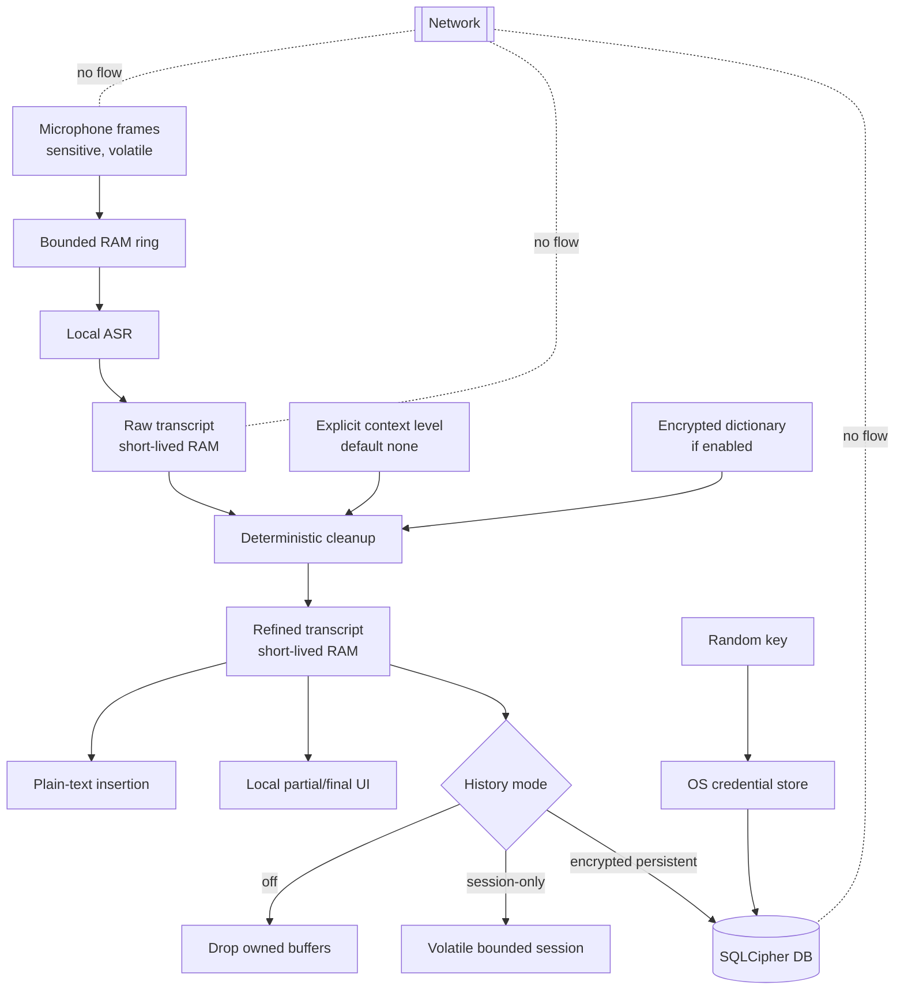

# FlowDictate Privacy Model

Status: **Proposed**  
Principle: prevent collection and persistence first; encrypt only what the user explicitly chooses to retain

## Privacy invariants

- Level 0 context, history off, personalization off, audio storage off, telemetry absent, and network access absent are defaults.
- The normal dictation path reads microphone frames and emits text; it does not inspect the clipboard, screen, files, or unrelated windows.
- Enabling one purpose does not imply consent to another. History, personalization, context, diagnostic export, audio export, experimental model selection, and microphone listening are separate controls.
- The application does not create an account, device identifier, advertising identifier, or remote user profile.
- No third party or sub-processor receives user data because production has no external data flow.

## Local privacy data flow



## Data inventory and lifecycle

| Data | Classification | Source | Default retention | Optional retention | Storage/security | User controls |
|---|---|---|---|---|---|---|
| Raw microphone audio | Sensitive personal | OS microphone | RAM until consumed/segment cancelled | Explicit diagnostic/training export only, never implicit | Bounded buffers; no normal-path files | Stop/cancel; separate export consent |
| Raw transcript | Sensitive personal | Local ASR | Until deterministic/fallback decision completes | Encrypted history if explicitly enabled and necessary | Short-lived bounded RAM or SQLCipher | History mode, delete/export |
| Refined transcript | Sensitive personal | Local refinement | Until insertion/recovery timeout | Session RAM or encrypted history | Avoid immutable copies; no release logs | History mode, delete/export |
| Partial hypothesis | Sensitive personal | Local ASR | Replaced/committed within current segment | None | UI receives only current bounded state | Hide overlay; cancel |
| Current app identity | Personal/context metadata | OS focus API | Current operation only | None in v1 | RAM only | Context Level 0/1 |
| Selected text/textbox content | Sensitive context | OS accessibility API | Current explicitly authorized operation only | None by default | Bounded RAM; separate untrusted-content type | Context Level 2, visible indicator |
| Personal dictionary | Sensitive personal | Explicit user entry/import | None if personalization off | Encrypted persistent | SQLCipher; import validation | Inspect/add/delete/export/reset |
| Learned correction | Sensitive personal/inferred | Explicit correction workflow | None by default | Encrypted, transparent personalization | SQLCipher; provenance and confidence | Enable/disable, inspect/delete/reset |
| Privacy settings | Internal; security relevant | User | Persistent | Persistent | Local config, no secrets, integrity validation | View/reset |
| Database key | Secret | CSPRNG | OS credential lifetime | Until local data deletion | OS credential store only; owned copies zeroized | Delete all data destroys entry |
| Model files | Non-personal but untrusted | Explicit local import/install | Until uninstalled | Same | Approved root; size/hash allowlist | Inspect/remove/import |
| Operational logs | Internal, non-sensitive only | Typed events | Short bounded local retention | Developer build only for richer safe metrics | Allowlisted fields; no payloads | View/delete logs |

## Context permission ladder

| Level | Data permitted | UI requirement | Prohibited |
|---:|---|---|---|
| 0 default | None beyond dictated audio | Show `Context: None` | Focus identity, selected text, clipboard, screen, files |
| 1 | Current application identity only | Persistent visible setting and per-session indicator | Text content, clipboard, screenshots |
| 2 | Selected text or current textbox content for the active target | Explicit enablement plus active-use indicator; bounded length | Whole window, other controls/windows, ambient capture |
| 3 | Named, purpose-specific local source | Separate explicit authorization with preview and revocation | General filesystem scan, silent expansion |

Context data is never a system instruction. It is untrusted content and cannot enable a higher permission level.

## History modes

### Off (default)

- No transcript rows, caches, recovery files, audio files, or hidden personalization are created.
- Current segment exists only in bounded RAM.
- Insertion failure exposes a short-lived in-app recovery view; it is not automatically copied.

### Session-only

- Transcript data remains in bounded process memory until session end, explicit clear, timeout, or exit.
- No crash recovery is promised because writing it would violate the selected mode.

### Encrypted persistent

- Available only after SQLCipher and an approved OS credential backend pass runtime checks.
- The UI states retention and deletion behavior before enablement.
- Raw transcript retention should be independently configurable and defaults off even when refined history is on.
- Records carry purpose, creation time, retention class, and deletion state; no hidden analytics identifiers.

## Personalization transparency

- Learning is opt-in, not inferred from mere dictation.
- Every learned entry records the user-visible replacement and provenance category, not raw surrounding transcript unless explicitly authorized.
- The user can inspect, edit, disable, delete one, export, and reset all entries.
- Imports are previewed and schema/hash checked before an atomic merge.
- Exports contain only requested profile fields; encrypted export is preferred, with explicit risk warning for plaintext.

## Logging contract

Allowed release fields are enumerated, not merely redacted:

```text
timestamp, safe_event_code, pipeline_state, duration_bucket_ms,
buffer_occupancy_bucket, model_identifier, local_error_code,
platform, build_version
```

Forbidden values include samples, transcript fragments/hashes, prompts, textbox/selection content, dictionary entries, clipboard content, filenames supplied by users, database keys, tokens, stable device identifiers, usernames, and full paths. Hashing a transcript does not make it non-sensitive and is forbidden.

## Privacy dashboard contract

The settings UI must derive, not hard-code, these claims:

```text
NETWORK ACCESS       NONE (release invariant/test status)
CLOUD PROCESSING     NONE
TELEMETRY            NOT PRESENT
AUDIO STORAGE        OFF
HISTORY              OFF | SESSION-ONLY | ENCRYPTED PERSISTENT
CONTEXT ACCESS       LEVEL 0 | 1 | 2 | named Level 3 grant
PERSONALIZATION      OFF | EXPLICIT | LEARNING ON
MODEL                identifier + local verification status
DATABASE             DISABLED | ENCRYPTED | LOCKED/UNAVAILABLE
```

If a verification has not run for the current build, the UI must not represent it as verified.

## Deletion and portability

- `Delete all local data` closes workers, destroys the SQLCipher database and sidecars, removes the OS credential entry, clears in-app caches, and verifies paths remain within the application data root.
- Single-entry deletion is logical/database deletion; the UI documents that SQLite pages, WAL, filesystem journals, SSD wear leveling, backups, or snapshots may retain physical remnants.
- Key destruction provides cryptographic erasure only to the extent that no key copies/backups remain; it is not marketed as guaranteed physical erasure.
- Profile/history export is local and machine-readable. No export is transmitted automatically.

## Legal/privacy-assessment note

Spoken voice and transcripts can contain personal and sensitive data. The system is designed for local personal processing with no vendor recipients, but regulatory scope depends on deployment and user context. This document supplies engineering inputs, not a legal determination. Any enterprise monitoring, shared-device deployment, or processing of other people's conversations requires a separate privacy/legal assessment and may change consent obligations.

## Privacy acceptance evidence

- Unique marker strings never appear in release logs, temp directories, crash recovery, or unencrypted storage.
- Normal flow produces no clipboard reads/writes and no audio files.
- Level 0 triggers no context API calls.
- Outbound-blocked execution retains normal functionality and initiates no application network connection.
- Persistent history is unavailable when SQLCipher/key storage verification fails.
- Delete/export/reset operations are tested with exact local-scope targets and human-readable results.
