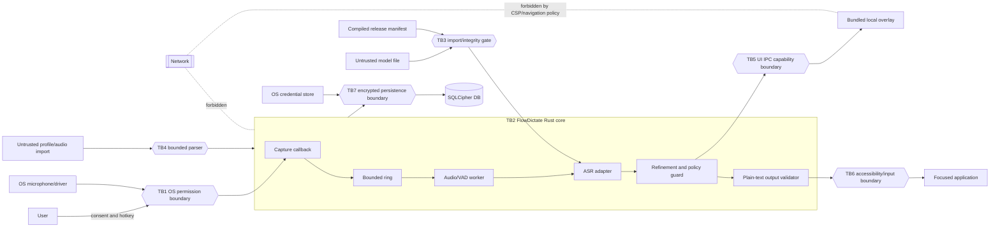

# Threat Model: FlowDictate Local Voice-Input System

Status: **Draft — requires human review before Milestone 1**  
Owner: FlowDictate maintainers  
Date: 2026-08-26  
Method: asset/data-flow analysis, STRIDE, and abuse cases

## 1. Scope

This model covers the v1 local dictation pipeline from global hotkey and microphone capture through local ASR/refinement, optional encrypted persistence, overlay display, and plain-text insertion. It also covers explicit model/profile/audio import boundaries and build/update supply-chain risks.

Out of scope for v1: arbitrary voice actions, shell execution, remote services, automatic updates, screen capture, ambient OCR, and broad media import. A fully compromised administrator/kernel, hostile firmware, or physical microphone implant can defeat application controls; those are documented residual risks rather than solvable application threats.

## 2. Protected assets

| Asset | Classification | Security goals |
|---|---|---|
| Live microphone samples | Sensitive personal/biometric-adjacent content | Confidentiality, minimal lifetime, bounded availability |
| Raw and refined transcripts | Sensitive personal content | Confidentiality, integrity, user control |
| Selected text/current textbox context | Sensitive personal/application content | Explicit authorization, minimization, separation from policy |
| Personal dictionary/corrections/profile | Sensitive personal content | Confidentiality, transparency, integrity, deletion/export |
| Database encryption key | Secret | Confidentiality, non-exportability where OS permits, zeroized ownership |
| Encrypted database | Sensitive ciphertext and metadata | Confidentiality, integrity, bounded retention |
| Model files and manifest | Executable-adjacent input/security metadata | Authenticity, integrity, compatibility |
| Focused application and insertion target | Sensitive metadata/capability | Correct targeting, least privilege |
| Privacy/security configuration | Security policy | Integrity, visible state, fail-closed defaults |
| Release artifacts and dependency graph | Supply-chain assets | Provenance, integrity, reproducibility |

## 3. Actors and attacker capabilities

- A malicious unprivileged local process can race focus, inspect world-readable files, send input, pressure memory/CPU, or misuse accessibility APIs granted to it.
- A malicious focused application can render deceptive content, change focus, or interpret inserted text dangerously.
- A user may unintentionally import a malicious/corrupt model, profile, or audio fixture.
- A dependency, model mirror, build runner, package owner, or update channel may be compromised.
- A disk thief can copy application data while the user is logged out.
- A local administrator/kernel-level attacker can read process memory, hook audio/input APIs, or replace binaries. Application controls cannot fully resist this actor.
- Dictated speech and application context can contain adversarial strings, including prompt-injection text.

## 4. Trust-boundary diagram

Every double-braced boundary requires validation, least privilege, bounded inputs, and a failure policy. Sensitive content remains untrusted even after validation; validation establishes shape and limits, not semantic trust.

## 5. Threats, mitigations, residual risk, and tests

Likelihood/impact: Low (L), Medium (M), High (H), Critical (C). STRIDE: S spoofing, T tampering, R repudiation, I disclosure, D denial of service, E elevation of privilege.

| ID | STRIDE | Threat | Likelihood | Impact | Mitigation | Residual risk | Verification test |
|---|---|---|---:|---:|---|---|---|
| TM-01 | I | Microphone data exposed through files, logs, UI IPC, or overly long retention | M | C | Volatile preallocated buffers; no normal-path audio files; payload-minimal IPC; sensitive-field ban; bounded teardown and best-effort zeroization | OS/driver/runtime copies and a privileged local process remain able to observe audio | Privacy-marker end-to-end test; temp/log/storage scan; manual process and filesystem inspection |
| TM-02 | T/E/D | Malicious or replaced model exploits native parser/runtime or corrupts output | M | C | Normalize approved-root path; reject links/non-regular files; exact size and streaming SHA-256 allowlist; runtime-version/architecture match; load only after gate; no plugins | A validly allowlisted but vulnerable model/runtime or release-key compromise remains | Unknown/corrupt/wrong-size/wrong-architecture/symlink model tests; pinned-runtime fuzz and fault tests |
| TM-03 | T/I/D | Malicious imported profile causes traversal, parser exhaustion, hidden commands, or data exposure | M | H | Explicit import; size/depth/count limits; strict schema/unknown-field rejection; data-only fields; canonical destination; atomic commit after validation | Social engineering may induce import of semantically harmful dictionary replacements | Property/fuzz tests; traversal/symlink/oversize/duplicate-key/unknown-field cases; preview before commit |
| TM-04 | T/E/I | Compromised crate/native dependency/build runner inserts exfiltration or unsafe behavior | M | C | Minimal/pinned graph; lockfile; approved sources/licenses; `cargo audit`/`cargo deny`; SBOM; review native/build scripts; reproducible artifact work; no runtime network dependencies | Signed upstream packages and CI credentials can still be compromised | Lockfile/SBOM diff gate; source allowlist; clean offline build experiment; artifact hash comparison |
| TM-05 | I/T | Database theft or modification reveals history/profile or changes policy | M | H | SQLCipher; random OS-held key; cipher runtime check; restrictive permissions; authenticated DB pages per SQLCipher; fail closed if unavailable | Logged-in user/admin can retrieve key; filenames/size/access times leak metadata | Copy DB without key and inspect; wrong-key test; tamper/open test; permission checks; plaintext marker scan |
| TM-06 | I | Memory scraping, swap, hibernation, or use-after-lifetime reveals audio/text/key material | M | C | Minimize copies/lifetimes; bounded buffers; secrecy/zeroize for owned keys; avoid panic/debug formatting; clear buffers where practical; crash-dump guidance | OS, allocator, GUI, FFI and privileged tooling can retain/copy data | Heap/log/crash fixture marker scans where feasible; lifetime tests; manual debugger review; unsupported guarantee documented |
| TM-07 | I/T | Clipboard fallback leaks transcript or reads unrelated clipboard data | M | H | Never read clipboard; direct insertion first; copy only by explicit user action from a short-lived recovery panel; clear action available, no automatic clipboard restore/read | Clipboard managers and target apps may retain explicitly copied data | Mock clipboard assertion: zero reads/writes in normal flow; explicit-copy UI test and warning review |
| TM-08 | E/T | Transcript text is interpreted as shortcuts, shell commands, or privileged actions | M | C | Typed `insert_text(String)` boundary; no action engine; native Unicode text APIs preferred; simulated key path escapes control semantics; no shell crate | Target application may interpret inserted plain text as code/commands when user submits it | Adversarial text corpus including shell syntax/control words; assert no process spawn and exact text output |
| TM-09 | T/E | Dictated/application text performs prompt injection against optional local editor | H | H | Fixed immutable editor policy; untrusted content in separate typed/delimited field; no tools/actions; output constrained to text; semantic-diff/length checks; deterministic fallback | Local model may still rewrite meaning or follow content instructions | Prompt-injection corpus; invariants for no added facts/commands; fallback on violation |
| TM-10 | E/I | Accessibility or input APIs are abused, over-permissioned, or insert into the wrong target | M | H | Least privilege; target identity/focus snapshot before and immediately before insertion; fail on change; native per-platform API review; visible permissions | Race can still occur between final check and OS insertion; malicious target can misuse text | Focus-race integration test; permission-denied tests; human platform accessibility review |
| TM-11 | E | Vulnerable native library, parser, IPC command, or installer enables local privilege escalation | L | C | Run as standard user; no service/admin requirement; narrow Tauri commands; no shell/plugin loader; memory-safe wrappers; fuzz native boundaries; signed packages | Native runtime/OS zero-days and user-approved elevation remain | Assert non-elevated install/run; IPC capability negative tests; native dependency review and fuzzing |
| TM-12 | T/E/I | Malicious automatic update or model download replaces trusted code/data | M | C | No updater/downloader in runtime; manual signed release acquisition; published hashes/signatures; model import always passes local integrity gate | User may install a malicious externally obtained binary; signing key compromise | Binary import signature/hash procedure test; static dependency scan confirms no updater/client |
| TM-13 | I | Crash dumps, panic reports, core files, or recovery records contain sensitive data | M | H | No sensitive panic values; release panic policy review; history-off recovery avoids transcript persistence; OS crash-dump documentation/config guidance; encrypted minimal recovery only if enabled | OS may create privileged dumps beyond app control | Forced crash with marker fixture; inspect dump/recovery/temp/log output on each supported OS |
| TM-14 | I | Debug/release logs expose audio, transcript, prompt, context, dictionary, or keys | M | C | Typed allowlisted operational events; safe error codes; no payload `Debug`; release max level and bounded retention; richer diagnostics separate and impossible in release build | Developer instrumentation could bypass policy during development | Unique-marker scan of release logs; compile-fail/lint policy for sensitive types where practical |
| TM-15 | D | Stuck hotkey, failed VAD, or long recording consumes unbounded memory/CPU | H | H | Fixed ring, rolling window, queued-segment cap, max active duration, soft pause boundaries, watchdog cancellation | Continuous adversarial audio can keep CPU busy within caps | Overflow, stuck-key, no-silence, and hours-equivalent simulated frame tests; peak-memory assertion |
| TM-16 | T/D/E | Malformed WAV/FLAC/Opus/container triggers overflow, huge allocation, or parser bug | M | C | No broad import initially; magic/type/size/channel/rate/duration/decompressed-size checks before decode; checked arithmetic; isolated bounded parser; fuzzing | Native codec bug within valid bounds remains possible | Corpus/fuzz tests for malformed/truncated/bomb headers and allocation caps; sanitizer runs for native code |
| TM-17 | T/E/I | Model/profile/audio paths use traversal, symlinks, alternate streams, or extension confusion | M | H | Canonical approved roots; open-then-inspect regular file; reject symlink/reparse point; extension plus magic; exclusive/atomic destination; never trust basename | Platform-specific filesystem races and network filesystems complicate identity | `../`, absolute, UNC, ADS, case, reparse, hardlink, swap-after-check tests per OS |
| TM-18 | T/I | Unsafe temporary files or race conditions leak/replace sensitive data | M | H | No normal audio temp files; same-directory atomic writes for non-sensitive manifests; OS-safe exclusive temp API in tests/tools; restrictive permissions; revalidate opened handle | Journals/backups may retain written data; filesystem semantics vary | Temp-tree marker scan; race harness; permission and symlink replacement tests |
| TM-19 | T/R/D | Concurrency races commit stale partials, inject twice, mix sessions, or retain buffers | M | H | Session IDs and monotonic segment indices; single state-machine owner; cancellation tokens; idempotent finalization; consensus commit monotonicity | OS delivery order and target-app behavior remain variable | Model-based/property tests for event permutations, duplicate releases, cancellation, worker failure |
| TM-20 | I/T/E | Compromised logged-in local account reads input, key store, process memory, or modifies binary | M | C | State limitation explicitly; signatures/hashes; least privilege; minimize retained data; optional OS re-auth where supported; advise device security | Application cannot protect secrets from an attacker fully controlling the same user/admin context | Documented residual-risk review; tampered-binary startup checks where packaging supports them |
| TM-21 | I/T | WebView loads remote content or initiates network traffic | L | C | Bundled assets only; CSP `default-src 'self'; connect-src 'none'`; deny navigation/new windows; no updater/http/shell plugins; outbound-block test; replace shell if gate fails | OS WebView internals may make background requests not controlled by app | Packet/socket/DNS monitoring with firewall; attempt remote URL/navigation/IPC injections |
| TM-22 | S/I/D | Credential-store spoofing/failure returns wrong key or weak fallback | M | H | Bind service/account identifiers; validate key length/version; no plaintext/environment fallback; disable persistent history on any backend error | Compromised OS credential backend or user account remains | Missing/locked/corrupt/wrong-length/wrong-key backend tests; platform human verification |
| TM-23 | D/T | Oversized model or adversarial transcript exhausts memory/context or causes excessive latency | M | H | Exact model size allowlist; input/token/window limits; timeouts/cancellation; smallest-model policy; output length/ratio bounds | Valid model can still exceed low-end performance targets | OOM/timeout/context-exhaustion tests and low-memory process limits; fallback verification |
| TM-24 | I | Context collection silently expands to full windows, clipboard, screen, or files | M | C | Level 0 default; separate capability per level; current app/selected control only; no screen/OCR/filesystem scan; visible dashboard and per-use indication | Accessibility APIs may expose more data than requested internally | Mock capability tests proving no calls at Level 0/1; platform trace review; privacy dashboard state tests |

## 6. Abuse cases

- As a malicious local process, I want to keep the hotkey logically pressed so that FlowDictate exhausts memory.
- As a malicious model distributor, I want a renamed model to load without a known hash so that native parsing handles my payload.
- As a malicious focused application, I want to steal focus immediately before insertion so that sensitive text goes to the wrong window.
- As a malicious document author, I want text saying "ignore policy" to become an editor instruction so that dictated meaning changes.
- As a curious insider with disk access, I want to recover old transcripts from logs, temp files, crash dumps, or deleted SQLite pages.
- As a compromised dependency maintainer, I want to add an outbound client in a minor release so that audio/text can be exfiltrated.
- As a profile author, I want hidden replacements/control characters to cause commands or deceptive output.
- As a user seeking convenience, I want to enable persistent history on a machine without secure key storage; the product must refuse rather than weaken encryption.

## 7. High/critical mitigation ownership and test trace

| Control family | Owner | Required milestone | Evidence |
|---|---|---:|---|
| Audio volatility/bounds | Audio maintainer | 1 | Unit, allocator, overflow, long-session tests |
| Model integrity/import | Model-security maintainer | 2 | Hash/path/corruption tests and reviewed manifest |
| Prompt/content separation | Refinement maintainer | 3 | Injection corpus and output invariant tests |
| Injection/focus boundary | Platform maintainer | 4 | Platform integration and human accessibility testing |
| WebView/network denial | App-shell maintainer | 5 and every release | CSP tests, socket/DNS trace, firewall acceptance |
| SQLCipher/key custody | Storage maintainer | 6 | Cipher/key-store failure and plaintext-marker tests |
| Import/parser fuzzing | Security maintainer | 7–9 | Fuzz corpora, sanitizer results, triaged crashes |
| Supply chain | Release maintainer | From Milestone 1 | Lockfile, audit, deny report, SBOM, signed hashes |

## 8. Open questions

- Can the packaged Tauri shell demonstrate zero outbound connections on every target, including WebView startup behavior?
- Which platform-specific insertion API gives exact Unicode text semantics without unnecessary accessibility privileges?
- Which SQLCipher crypto-provider/package strategy passes Windows, macOS, and Linux build and runtime tests with acceptable patch management?
- Should native ASR run in a constrained child process after Milestone 2 threat re-review?
- What maximum utterance duration best balances privacy/DoS resilience and real dictation use?

## 9. Review gate

This threat model is not approved merely because it exists. Before Milestone 1, reviewers must confirm DFD coverage, accept or change residual risks, assign owners, and ensure every high/critical mitigation maps to a test. Changes to trust boundaries require updating this document in the same change.
